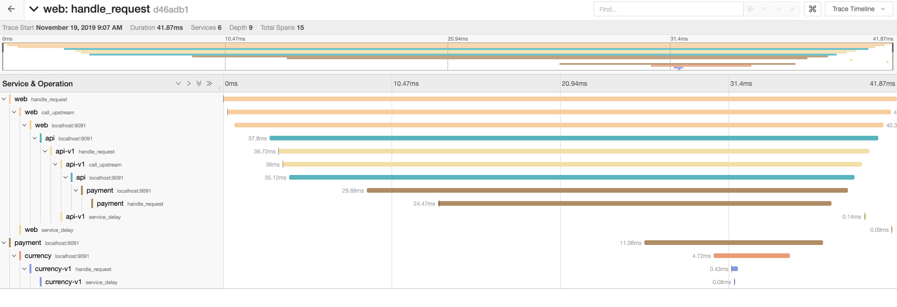

# Tracing

The application you deployed in the previous step has been configured to use the [Zipkin](https://zipkin.io/) tracing protocol. Let's curl the Web endpoint to generate some traces.

> Remember; if you are using the Shipyard Visual studio code environment or Instruqt use `dockerhost` instead of `localhost`!

```shell
➜ curl localhost:9090
{
  "name": "web",
  "uri": "/",
  "type": "HTTP",
  "start_time": "2019-11-18T15:01:32.655519",
  "end_time": "2019-11-18T15:01:32.710236",
  "duration": "54.7199ms",
  "body": "Hello World",
  "upstream_calls": [
    {
      "name": "api-v1",
      "uri": "http://localhost:9091",
      "type": "HTTP",
      "start_time": "2019-11-18T15:01:32.691269",
      "end_time": "2019-11-18T15:01:32.707108",
      "duration": "15.8386ms",
      "body": "Response from API v1",
      "upstream_calls": [
        {
          "uri": "http://localhost:9091",
          "code": 200
        }
      ],
      "code": 200
    }
  ],
  "code": 200
}
```

Jaeger has been configured to collect and visualize the traces, all spans are sent are transmitted from the applications and Envoy proxies and are collected in Jaeger. 
If you look at the Jaeger UI, and view a trace from the `web` service you will see the individual spans which make up a trace.

[localhost:16686/search?service=web](localhost:16686/search?service=web)


Traces are broken up into individual spans which relate to an action or function. The spans can have metadata in the form of Tags, and Logs attached to them. Click on one of the spans to see the metadata.


Spans are related by their ID, when a new span is created the ID of the parent is associated with it. The entire trace is not transmitted to the server in a single document, as a trace can contain spans for multiple different services. Instead each span is transmitted to the server individually, it is the relation between parent and child which allows Jaeger to be able to reconstruct the individual spans into a trace.

When you are creating spans in code, you can easily create child spans as the relation can be passed using the OpenTracing API. The problem is how do you pass the span id to an external service, like when you call an upstream API? An example of this problem can be seen with the `Payment` and `Currency` service in the example app.

If you look at the trace, the last span in the chain is the `payments` span which has been created by the Envoy proxy in the service mesh. However; the full call chain should be Web -> API -> Payment -> Currency. The spans for `Payments` and `Currency` can be found in the Jaeger UI if you select them in the `Service` search box, but they are detached from the main trace.

The reason behind this is that the Payment service is not aware of any parent span id from the API service.

To rectify this situation we need to do two things: 
1. When making a call to an upstream service we pass the span id, trace id, and parent span id as HTTP headers. [https://github.com/openzipkin/b3-propagation](https://github.com/openzipkin/b3-propagation).
2. When handling requests we need to look for the presence of the zipkin headers, and use this information when creating a new span.
 
```
X-B3-TraceId: 80f198ee56343ba864fe8b2a57d3eff7
X-B3-ParentSpanId: 05e3ac9a4f6e3b90
X-B3-SpanId: e457b5a2e4d86bd1
X-B3-Sampled: 1
```

Thankfully the OpenTracing SDK makes this process nice and simple.

Open the `handler.go` file in the `payments-service` folder and add the following code to `line 14`. This code automatically extracts the headers from the request and creates a `SpanContext`. You can then use this when creating the span.

```go
// attempt to create a span using a parent span defined in http headers
	wireContext, err := opentracing.GlobalTracer().Extract(
		opentracing.HTTPHeaders,
		opentracing.HTTPHeadersCarrier(r.Header),
	)

	if err != nil {
		// if there is no span in the headers an error will be raised, log
		// this error
		logger.Debug("Error obtaining context, creating new span", "error", err)
	}
```

Modify the `StartSpan` block to add the additional option `ext.RPCServerOption`, this will associate the new Span with the details from the inbound request.  

```go
	// Create the span referring to the RPC client if available.
	// If wireContext == nil, a root span will be created.
	serverSpan := opentracing.StartSpan(
		"handle_request",
		ext.RPCServerOption(wireContext))
```

You will also need to import the `ext` package, add the following to your handler.go import statements.

```go
"github.com/opentracing/opentracing-go/ext"
```

In the same way that the parent span is not automatically inferred from the headers the span id and other headers are not automatically added to the outbound request. We can add this information again using the OpenTracing API. First we are creating a new `clientSpan` using the context of the parent spans context.  We then are just adding some logging for the upstream type. The `SetKindRPCClient`, `HTTPUrl`, and `HTTPMethod` methods are convenience methods which set a default tag for us.

Where things get interesting is the `Inject` method call. What we are doing in this method call is injecting the headers for the Zipkin span as HTTP headers in our request. The nice thing about `OpenTracing` is that this workflow remains the same, not matter which tracing system you are using.

Add the following code to `line 29` in `handler.go`:

```go

clientSpan := opentracing.StartSpan(
	"call_upstream",
	opentracing.ChildOf(serverSpan.Context()),
)

clientSpan.LogFields(log.String("upstream.type", "http"))

ext.SpanKindRPCClient.Set(clientSpan)
ext.HTTPUrl.Set(clientSpan, req.URL.String())
ext.HTTPMethod.Set(clientSpan, req.Method)

// Transmit the span's TraceContext as HTTP headers on our
// outbound request.
opentracing.GlobalTracer().Inject(
	clientSpan.Context(),
	opentracing.HTTPHeaders,
	opentracing.HTTPHeadersCarrier(req.Header))
```

You will also need to add the following import to the imports declaration at the top of `handler.go`:

```go
"github.com/opentracing/opentracing-go/ext"
```

You can now re-build the application, the build will complete 100% in Docker using a multistage build, if you go to your terminal in the `payments-service` folder and execute the following command to build a new version and tag it as `v2.0.0`.

```shell
docker build -t nicholasjackson/broken-service:v2.0.0 .
```

```shell
Sending build context to Docker daemon  8.032MB
Step 1/10 : FROM golang:alpine
 ---> 3024b4e742b0
Step 2/10 : COPY . /go/src/github.com/hashicorp/consul-service-mesh-for-developer/payment-service
 ---> 3ecd14dc6eef
Step 3/10 : WORKDIR /go/src/github.com/hashicorp/consul-service-mesh-for-developer/payment-service
 ---> Running in 10649f33c839

#...

Removing intermediate container 524e1417ed99
 ---> 1e5194aff731
Successfully built 1e5194aff731
Successfully tagged nicholasjackson/broken-service:v2.0.0
```

You can now deploy the new version of the service. To avoid having to push the Docker image to a remote repository we can use the `shipyard push` command to push the image to Kubernetes image cache. Run the following command in your terminal.

```shell
➜ yard push --image nicholasjackson/broken-service:v2.0.0
## Pushing image nicholasjackson/broken-service:v2.0.0 to cluster shipyard
```

Now let's deploy the new version to our Kubernetes cluster, the file `payments_blue.yml` in the `2_tracing` folder already has been updated with the reference to the new image which you have just built.

```yaml
containers:
- name: payment
  image: nicholasjackson/broken-service:v1.0.0
  imagePullPolicy: IfNotPresent
  ports:
  - containerPort: 8080
  env:
  - name: "TRACING_ZIPKIN"
    value: "http://jaeger:9411"
  - name: "CURRENCY_ADDR"
    value: "http://localhost:9091"
```

Deploy the updated application using `kubectl`:

```shell
➜ kubectl apply -f ./2_tracing/payments_blue.yml
deployment.apps/payment-deployment-blue configured
```

Again let's curl the service to capture some traces.

```shell
➜ curl localhost:9090                                   
{
  "name": "web",
  "uri": "/",
  "type": "HTTP",
  "start_time": "2019-11-19T09:02:51.138696",
  "end_time": "2019-11-19T09:02:51.194127",
  "duration": "55.4355ms",
  "body": "Hello World",
  "upstream_calls": [
    {
      "name": "api-v1",
      "uri": "http://localhost:9091",
      "type": "HTTP",
      "start_time": "2019-11-19T09:02:51.146530",
      "end_time": "2019-11-19T09:02:51.191146",
      "duration": "44.6169ms",
      "body": "Response from API v1",
      "upstream_calls": [
        {
          "uri": "http://localhost:9091",
          "code": 200
        }
      ],
      "code": 200
    }
  ],
  "code": 200
}
```

When you again look at the traces [http://localhost:16686/search?service=web](http://localhost:16686/search?service=web) you should now see the `Payment`, and `Currency` services correctly showing as part of the trace.



## Summary