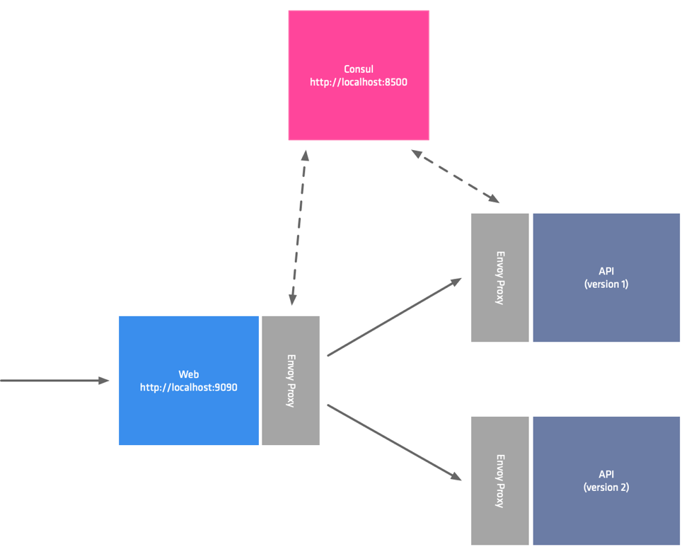

# Canary Deployments

In the previous example we refactored an existing service to add the required functionality for distributed tracing. One thing we did not do was make any safeguards around the deployment. We pushed the code and hoped it would work. Bugs in software are an inevitable part of the development process. They take many forms from simple mistakes to misunderstood or missing requirements. While unit, functional and manual testing helps to weed out, and squash these bugs. One thing which is difficult to identify in a non-production environment is bugs which exist due to configuration, or differences between dev, testing, and production.

Over the last few years we have become more mature at observing our systems, when I first started developing the client was your "Pager Duty". Thankfully metrics and tracing allow us to be more aware of problems in our systems. The proliferation of tooling, like the Service Mesh, allows us to easily modify our deployments processes without the need for a large amount of complex and bespoke technology.

In this section we are going to look at how can add greater assurance round our new deployments using a technique know as Canary deploys. With Canary deployments you simultainiously run the old and new versions of your application in production. By sending a small ammount of traffic to the service, you can ensure that it is functioning correctly by observing it in production. As confidence grows, you increase the amount of traffic to the canary. In the instance that things are not behaving as expected then you direct all of the traffic back to the old version.



The architecture team have decided that they would like all the applications developers to use a custom package which the platform team has written. This package wraps Go's HTTTP client. Your first task is to replace the call to `http.DefaultClient().Do()` with the custom `sleepy-client`. The custom client has the same signature as the Go package, so you can directly replace line `44` with the sleepy client.

```go
	c := &sleepy.HTTP{}
	resp, err := c.Do(req)
```

You will also need to import the custom package by adding it to the import statement.

```
sleepy "github.com/nicholasjackson/sleepy-client"
```

Once you have everything up and running you can test the code before packaging it in the docker container.

```shell
➜ go test ./...
ok      example.com/broken/payment-service      0.013s
```

Everything should be functioning as expected, you can now build the new version of the application as you did in the previous exercise. This time we are going to use the `v3.0.0` version.

```
docker build -t nicholasjackson/broken-service:v3.0.0 .
```

This image can then be pushed to your Kubernetes cluster.

```
yard push --image nicholasjackson/broken-service:v3.0.0
```

If you look at the folder `3_canary` you will find the service deployment for the new version `payments_green.yml`.

Unlike the previous deployment where we overwrote the version 1 with version 2, this time we have created a completely new deployment, so both versions will exist at the same time.

```yaml
apiVersion: apps/v1
kind: Deployment
metadata:
  name: payment-deployment-green
  labels:
    app: payment-green
```

The service name has not changed even though this is a completely separate deployment. All instances of both `payment-deployment-green` and `payment-deployment-blue` will be registered in Consul's service catalog with the name `payment`.

Examining this file further, you will see that we are using custom annotations `service-meta-version`, and `service-tags`. Because we are not chaning the serivce name these annotations allow us to associate metadata with the service instances. When we create our Canary deployment configuration in the next step, we will be able to filter service instances using this metadata.

```yaml
annotations:
  "consul.hashicorp.com/connect-inject": "true"
  "consul.hashicorp.com/connect-service-upstreams": "currency:9091"
  "consul.hashicorp.com/service-meta-version": "3"
  "consul.hashicorp.com/service-tags": "v3"
```

Before we deploy our service, we need to create the configuration for the Canary, otherwise; traffic would be round robin load balanced across all insances of the `payments` service which includes our new and untested code.

To configure this you first need to create a `service-resolver`, this configuration allows us to define subsets for our service which we can direct a percentage of our traffic to. `default_subset` allows us to ensure that in the absence of any routing, or traffic-splitting configuration, all traffic will be directed to the blue version of the service.

```ruby
kind = "service-resolver"
name = "payments"

# https://www.consul.io/api/health.html#filtering-2
# Show Node.Meta demonstration showing performance testing a new instance type
default_subset = "blue"

subsets = {
  blue = {
    filter = "Service.Meta.version == 2"
  }
  green = {
    filter = "Service.Meta.version == 3"
  }
}
```

You can apply this file by using the command `consul config write`

```
consul config write payments_resolver.hcl
```

Now the resolver has been written it is safe to deploy our new version of the payments service, no traffic will be directed to this until we create our traffic splitting rules.

```
kubectl apply -f 3_canary/payments_green.yml
```

You can check that your service is only resolving to the v2 of the payments service by curling the `web` service.

```
curl localhost:9090
{
  "name": "web",
  "uri": "/",
  "type": "HTTP",
  "ip_addresses": [
    "10.42.0.14"
  ],
  "start_time": "2019-11-21T20:35:47.751446",
  "end_time": "2019-11-21T20:35:47.776328",
  "duration": "24.882855ms",
  "body": "Hello World",
  "upstream_calls": [
    {
      "name": "api-v1",
      "uri": "http://localhost:9091",
      "type": "HTTP",
      "ip_addresses": [
        "10.42.0.10"
      ],
      "start_time": "2019-11-21T20:35:47.759473",
      "end_time": "2019-11-21T20:35:47.774810",
      "duration": "15.337719ms",
      "body": "Response from API v1",
      "upstream_calls": [
        {
          "uri": "http://localhost:9091",
          "code": 200
        }
      ],
      "code": 200
    }
  ],
  "code": 200
}
```

The next step is to direct a small percentage of traffic to the new service. The ammount of traffic you direct to the new service depends on a number of factors such as, your confidence in the change, and actually how busy the service is. When choosing this figure, I recommend you send the smallest amount of traffic which will give you enough meaningful information so that you can observe its behaviour.  Since we are not running in a real environment for the workshop we are going to set the split to 50/50 so that we can see quickly test our changes.

In the following example you can see a simple service splitter which enables this 50/50 split between the blue and green versions of our service which we defined in the `service-resolver`. The number of splits is not restricted only to 2, you can define as many splits as required. This allows for more advanced testing strategies such as Dark deployments.

```
kind = "service-splitter",
name = "payments"

splits = [
  {
    weight = 50,
    service_subset = "blue"
  },
  {
    weight = 50,
    service_subset = "green"
  }
]
```

Again let's apply this configuration using the Consul command line tool.

```
consul config write 3_canary/payments_splitter.hcl
```

You can now test your application, you might need to make a few requests to hit the green version of your service but over time this will average out as 50% of all requests.

```
➜ curl localhost:9090
{
  "name": "web",
  "uri": "/",
  "type": "HTTP",
  "ip_addresses": [
    "10.42.0.17"
  ],
  "start_time": "2019-11-20T14:54:27.430419",
  "end_time": "2019-11-20T14:54:32.439444",
  "duration": "5.009025002s",
  "upstream_calls": [
    {
      "name": "api-v1",
      "uri": "http://localhost:9091",
      "type": "HTTP",
      "ip_addresses": [
        "10.42.0.19"
      ],
      "start_time": "2019-11-20T14:54:27.436368",
      "end_time": "2019-11-20T14:54:32.438209",
      "duration": "5.00184028s",
      "upstream_calls": [
        {
          "uri": "http://localhost:9091",
          "code": -1,
          "error": "Error communicating with upstream service: Get http://localhost:9091/: net/http: request canceled (Client.Timeout exceeded while awaiting headers)"
        }
      ],
      "code": 500,
      "error": "Error processing upstream request: http://localhost:9091/"
    }
  ],
  "code": 500
}
```

Have you noticed that there seems to be a little bug in the new version of the service you have just deployed?

If this was a real production scenario you would roll this back straight away however we are going to use this bug to show you how simple reliability patterns can mask the problem from the end user. In our final exercise we will see how we can debug the service and locate the bug.

## Summary
In this section we have seen how we can improve quality by slowly introducing changes to the production environment. In the next section you will see how we can find the source of the problem by debugging a live service.