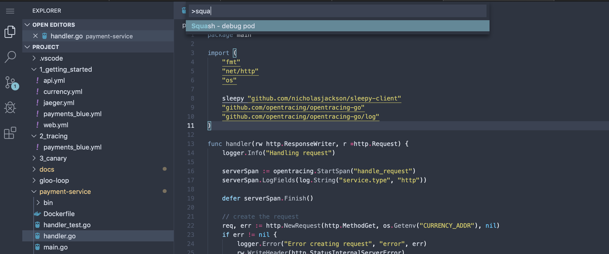
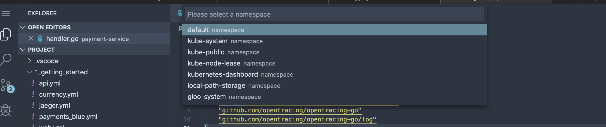
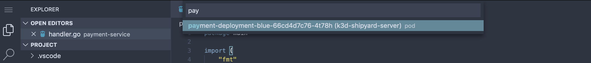
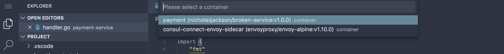
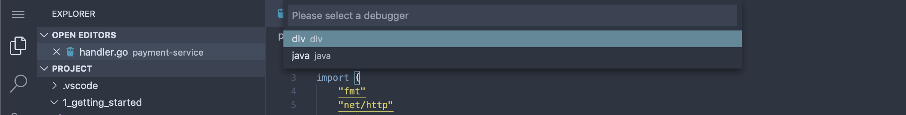
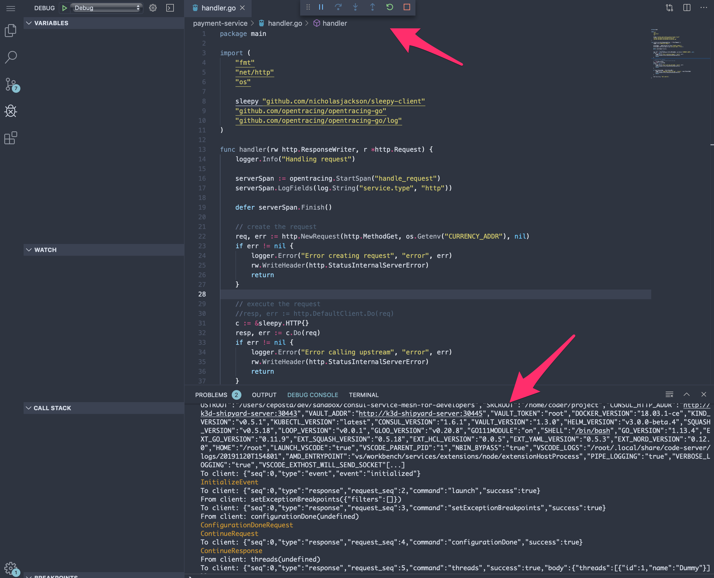
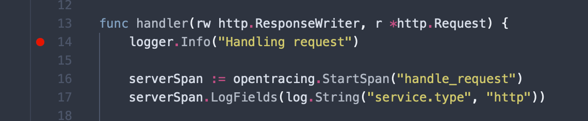
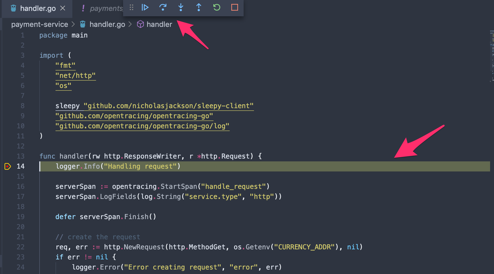
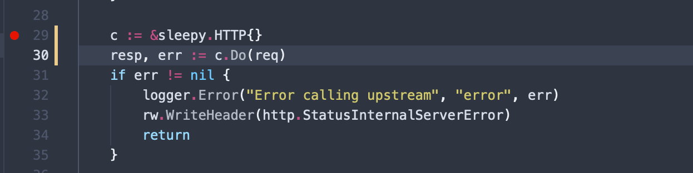

# Debugging microservices in Kubernetes

In the previous tutorials, we leveraged the service mesh from a developers' perspective to build resilience and observability into our service calls. This helps us both mitigate issues on the network between services as well as surface the appropriate signals to identify where and when there are issues. Ultimately, the service mesh can help save us from a cascading failure by improving resilience, but we need to couple this with debugging and fixing the issues altogether. 

In this part of the tutorial, we'll explore some mesh-complementary tools to debug a remote running microservice within your IDE and identify problems. We'll also explore how to do this in a more "production" like environment where you may not (most likely!) be able to connect up directly to the service running in production. We'll use a tool called `loop` that will allow us to record and reply requests from an environment. Let's get started.

## Debugging your services with Squash debugger

[Squash debugger](https://squash.solo.io) is a multi-language, distributed debugger that allows you to use your own IDE and other familiar tooling to debug microservices running in Kubernetes. Squash takes care of the plumbing to expose the debugging ports and remote debugger which should allow you to focus on "squashing" bugs instead of fumbling around with Kubernetes and `inode`s and so forth.


Squash is available as both a `squashctl` CLI tool as well as a plugin for VSCode. A plugin for IntelliJ/IDEA is also available, though a bit outdated. If there is interest in using this for IDEA, please let us know. For this tutorial, we'll use Squash through the VSCode extensions.

### Preparing

If you're running on your local machine, sometimes it takes a while to download some of the debugger images from the docker registry. Let's pre-pull the docker image needed to do the debugging for this exercise:

```shell
docker pull quay.io/solo-io/plank-dlv:0.5.18
```

### Pick a pod to debug

From within the VSCode web-based IDE, hit "CTRL+Shift+P" to bring up the plugin dialog and start typing "Squash". You should see the squash plugin pop up. Hit Enter on it:



Under the covers, the VSCode plugin leverages the `squashctl` cli tool, so you can use that alternatively if you wish. Squash will query the current Kubernetes context and navigate you through picking which service/pod you want to debug. Start by selecting the namespace to debug, in our case `default`:



Next, select a pod to debug. In this case we are going to debug the payment service, so start typing "pay..." into the search box to filter down the pods.



Next we need to pick which container to debug. Since we are deployed in a service mesh, we will need to decide between debugging the service-mesh sidecar or the application itself. In our case, we'll select the `payment` container.



Lastly, since Squash is a multi-language debugger, we need to decide which debugger to use. The source code for this service is written in Go, so we'll pick the `dlv` debugger. In future versions of squash, we're hoping to be able to auto-detect the language and default to a debugger. 




If this is your first time running Squash, give it a few moments to download the appropriate debugger image and get it started. For example, if you wish to see how it's doing, you can go to the terminal and check the `squash-debugger` namespace:

```shell
kubectl get po -n squash-debugger
NAME         READY   STATUS              RESTARTS   AGE
plankt48h2   0/1     ContainerCreating   0          2m33s
```

If it takes too long for the image to download and connect up with your IDE, delete the pod and try again:

```shell
kubectl delete po -n squash-debugger --all
```

If all goes well, you should be taken to the debug perspective:




### Setting break points

From here you can set a break point on the `payment-service` source code. The code that gets executed on a request is in the `handler.go` source. Place a break point on a location in that code and try exercise the `web` service which ultimately calls into the payment service:



Now if you exercise your service, you should hit the break point:




From here, you're in the VSCode debugger -- there's nothing special about squash here. You can step-by-step debug, step-over, or continue into the rest of the source code with full access to the call stack and context variables. You can use this approach to continue debugging for where things might be incorrect in your service. 

### Cleaning up

Once you're debugging session is done, whether you used the CLI or the IDE tools to bootstrap your debugger, it's always a good idea to clean up and lingering debugging sessions by deleting the `plank` pods in the `squash-debugger` namespace:

```shell
kubectl delete po -n squash-debugger --all
```

## Debugging our sleepy client

In the previous section, we introduced a new HTTP client that seems to be causing some issues. Following the debugging steps from above, set some break points and step through to find out exactly where the code is slowing down. 



Once you've debugged into the code, you should be able to tell that the sleepy client implementation seems to be inefficient and slow. 

## Debugging in production with Loop

Debugging with squash like we did in the previous section is powerful and is very useful in local dev-test loops. The problem is, once you get into a shared environment and up to the production-level environments, access levels become more restricted. Not too many organizations will just connect up IDE debuggers to your production environment, so we need to have an alternative way.


In this section, we're going to use a tool called Gloo Loop to be able to identify when there are issues in our production environment, save off those failed messages, and give us an opportunity to replay the messages in a staging or test environment. Doing this allows us to use the real production messages in a lower environment and observe how our services behave without affecting any live production traffic or users. 

### Getting started

To get started using loop, let's install the loop server:

```shell
kubectl apply -f gloo-loop/loop.yaml

namespace/loop-system created
configmap/loop-config created
serviceaccount/loop created
customresourcedefinition.apiextensions.k8s.io/tapconfigs.loop.solo.io created
clusterrole.rbac.authorization.k8s.io/loop-tap-manager-role created
clusterrolebinding.rbac.authorization.k8s.io/loop-role-binding created
service/loop created
deployment.apps/loop created
upstream.gloo.solo.io/loop created
```

Checking the loop server came up correctly:

```shell
kubectl get pod -n loop-system

NAME                    READY   STATUS    RESTARTS   AGE
loop-7485bd975b-fj4kz   1/1     Running   0          59s
```

Lastly, we need to expose the loop server locally for our CLI to connect. We can do that with the following `yard` command:

```shell
yard expose --service-name deploy/loop --namespace loop-system --port 5678:5678
```

If you want to expose using the regular Kubernetes client, you can do the following:

```shell
kubectl port-forward -n loop-system deploy/loop 5678 
```

### Listing existing loop captures

You can specify what messages or requests Loop should capture using a configuration file (which we'll show in the next section), but to see what requests have already been captured, you can run the following:

```shell
loopctl list

+----+------+------+--------+-------------+
| ID | PATH | VERB | STATUS | DESTINATION |
+----+------+------+--------+-------------+
+----+------+------+--------+-------------+
```

We see that we don't have any requests captured. Let's explore how loop works and how we can configure it to capture failed requests so we can replay them and debug. 

### How Loop works

Loop is implemented as a server-side controller as well as extensions to Envoy-based proxies through a feature called the ["Tap filter"](https://www.envoyproxy.io/docs/envoy/latest/configuration/http/http_filters/tap_filter). Using the tap filter in envoy, we have a way to specify a "match" predicate to determine exactly which messages we're interested in, as well as a way to capture them and stream them back. The server-side controller provides a sink for those captured messages to land and uses a CLI to allow users to interact with the system (ie, set configuration, view captures, replay, them, etc). 

In this tutorial, we're going to use the Gloo API Gateway, which is built on Envoy, with Loop enabled to capture any failed messages. Since this functionality is built into Envoy we could technically add this into the service mesh sidecar proxies as well. Check with us at [Solo.io](https://www.solo.io) for more on that as it's still under heavy development -- all Envoy based service meshes, including Consul Service Mesh, are targeted for support.

### Specifying match conditions

Specifying match conditions for the loop functionality (ie, which messages to capture and store for later playback) is done through configuration. Gloo and Loop (and all Solo projects) are configured through a declarative configuration model -- which complements the Kubernetes model very nicely.

For our simple example here, we'll specify a match condition that looks like this:

```yaml
apiVersion: loop.solo.io/v1
kind: TapConfig
metadata:
  name: gloo
  namespace: loop-system
spec:
  match: responseHeaders[":status"] == prefix("5")
```

This `TapConfig` resource says to capture any requests who's status starts with a `5`. For example, any request that results in an HTTP status of `500` would match this predicate. 

Let's apply this configuration to loop:

```shell
kubectl apply -f gloo-loop/tap.yaml

tapconfig.loop.solo.io/gloo created
```

Now we should have our Loop system configured for capture. Next we need to send some requests into the system that fail and observe that loop captures the requests.

### Capturing requests

To exercise this behavior, make sure one of the failing services from the previous section is enabled. When we introduced `payments` service (as a `green` deployment in a `blue-green` scenario), we saw that requests would timeout and an `HTTP 500` status was returned. Let's exercise this request, but the important part is to call this through the API Gateway which has Loop enabled. To do this, we need to expose the API Gateway like we did in the getting-started section:

```shell
yard expose --service-name svc/gateway-proxy-v2 --namespace gloo-system  --port 8081:80
```

You could expose directly in Kubernetes with:

```shell
kubectl port-forward svc/gateway-proxy-v2 -n gloo-system  8081:80
```

Also make sure the route was created to the `web` service. If it's not, here's a quick convenience command to do so:

```shell
$  glooctl add route --path-prefix / --dest-name default-web-9090

+-----------------+--------------+---------+------+----------+-----------------+--------------------------------+
| VIRTUAL SERVICE | DISPLAY NAME | DOMAINS | SSL  |  STATUS  | LISTENERPLUGINS |             ROUTES             |
+-----------------+--------------+---------+------+----------+-----------------+--------------------------------+
| default         | default      | *       | none | Accepted |                 | / ->                           |
|                 |              |         |      |          |                 | gloo-system.default-web-9090   |
|                 |              |         |      |          |                 | (upstream)                     |
+-----------------+--------------+---------+------+----------+-----------------+--------------------------------+
```

Now make a request:

```shell
curl -v localhost:8081
```

When you hit a failed request (HTTP 500), the Loop system should had recorded that. Note, any successful requests (HTTP 200) are NOT captured. To verify we captured a request, let's use loop:

```shell
loopctl list

+----+------+------+--------+-------------+
| ID | PATH | VERB | STATUS | DESTINATION |
+----+------+------+--------+-------------+
|  1 | /    | GET  |    500 |             |
+----+------+------+--------+-------------+
```

Yay! We've sorted through the requests and captured only the failing ones. Now let's see how we can replay this in a way that allows us to debug the system. 

### Replaying and debugging captured requests

Now that we've captured our failing requests, we can replay them. In this simplified scenario, we're only going to replay the request back through the `web` service. We can attach out debugger as we did in the previous section, set break points, and step-by-step debug through when we use loop to replay the requests:

```shell
loopctl replay --id 1 --destination web.default:9090
```

You should be able to hit the break points from here and replay the requests as many times as you need. 

In this part of the tutorial, we didn't move to a lower environment, but we did replay the requests without having to send them in ourselves. In other words, we _could_ move this to a different environment and replay the traffic, but to keep this tutorial simple enough, we just replayed in the same environment. 
