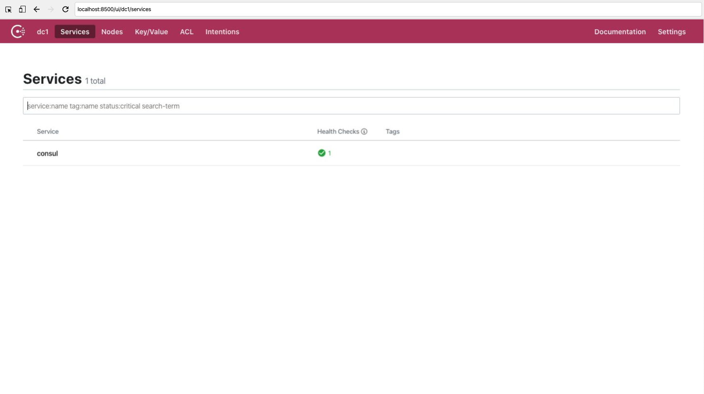
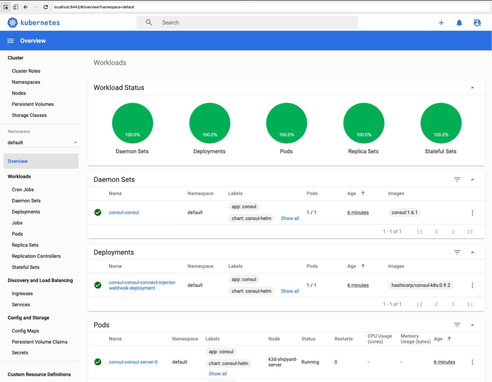
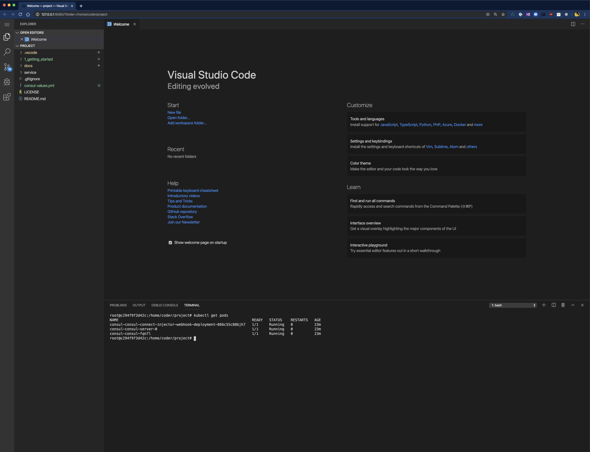
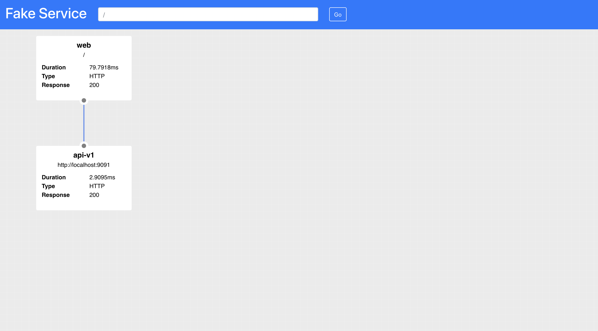
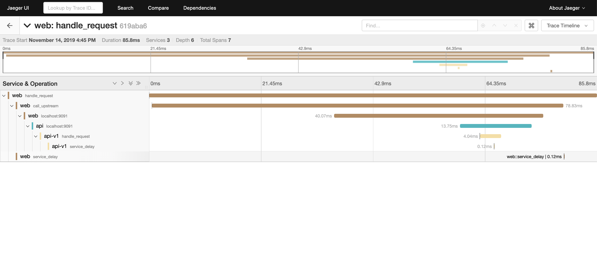

# Getting Started

In this section you will learn how to set up your system ready for the workshop.

## Requirements

* Docker - [https://docs.docker.com/install/](https://docs.docker.com/install/)
* Shipyard - [https://shipyard.demo.gs](https://shipyard.demo.gs)

## Clone the example repo

The code repository has source files and examples which will be used by this workshop, before continuing clone this repo.

```shell
git clone https://github.com/hashicorp/consul-service-mesh-for-developers.git
cd consul-service-mesh-for-developers
```

## Starting Kubernetes and Installing Consul Service Mesh

Once you have installed `Docker` and `Shipyard` you can use `Shipyard` to start a Kubernetes cluster with Consul Service Mesh pre-installed.

Run the following command in your terminal:

```shell
yard up --consul-values $PWD/consul-values.yml

     _______. __    __   __  .______   ____    ____  ___      .______       _______  
    /       ||  |  |  | |  | |   _  \  \   \  /   / /   \     |   _  \     |       \ 
   |   (----`|  |__|  | |  | |  |_)  |  \   \/   / /  ^  \    |  |_)  |    |  .--.  |
    \   \    |   __   | |  | |   ___/    \_    _/ /  /_\  \   |      /     |  |  |  |
.----)   |   |  |  |  | |  | |  |          |  |  /  _____  \  |  |\  \----.|  .--.  |
|_______/    |__|  |__| |__| | _|          |__| /__/     \__\ | _| `._____||_______/ 


Version: 0.2.11

## Creating K8s cluster in Docker and installing Consul

#...

### Setup complete:

To interact with Kubernetes set your KUBECONFIG environment variable
export KUBECONFIG="$HOME/.shipyard/yards/shipyard/kubeconfig.yml"

Consul can be accessed at: http://localhost:8500
Kubernetes dashboard can be accessed at: http://localhost:8443

To expose Kubernetes pods or services use the 'yard expose' command. e.g.
yard expose --service-name svc/myservice --port 8080:8080

When finished use "yard down" to cleanup and remove resources
```

You should will not be able to see the Consul UI at [http://localhost:8500](http://localhost:8500), and the Kubernetes dashboard at [http://localhost:8443](http://localhost:8443)

### Consul UI



### Kubernetes Dashboard



## Development Environment

Shipyard comes bundled with a built in development environment, you can of course use your own IDE and terminal if you have the tools installed but for the purposes of this workshop we are going to be using the built in tools like Go, KubeCtl, Consul, etc.

To start the built in IDE run the following command in your terminal:

``` shell
yard vscode

     _______. __    __   __  .______   ____    ____  ___      .______       _______  
    /       ||  |  |  | |  | |   _  \  \   \  /   / /   \     |   _  \     |       \ 
   |   (----`|  |__|  | |  | |  |_)  |  \   \/   / /  ^  \    |  |_)  |    |  .--.  |
    \   \    |   __   | |  | |   ___/    \_    _/ /  /_\  \   |      /     |  |  |  |
.----)   |   |  |  |  | |  | |  |          |  |  /  _____  \  |  |\  \----.|  .--.  |
|_______/    |__|  |__| |__| | _|          |__| /__/     \__\ | _| `._____||_______/ 


Version: 0.2.11

## Starting VSCode in a browser
Starting VS Code

When finished you can stop the VSCode server using the command:
docker kill vscode

c294f9f3d42c17ff9135ec3bd17e8951a4c5086290b51bbfe6e418e3dfca14ed
```



## Running the demo application

Now that Kubernetes and Consul are running you can install the example application.

Open a new terminal in the IDE ``Ctrl-Shift-` ``

The settings for `kubectl` and `consul` are already configured for you, give this a quick test.

### Getting all running pods `kubectl get pods`

```shell
kubectl get pods
NAME                                                              READY   STATUS    RESTARTS   AGE
consul-consul-connect-injector-webhook-deployment-866c55c88bjh7   1/1     Running   0          45m
consul-consul-server-0                                            1/1     Running   0          45m
consul-consul-fqn7l                                               1/1     Running   0          45m
```

### Display Consul members `consul members`
```shell
consul members
Node                    Address         Status  Type    Build  Protocol  DC   Segment
consul-consul-server-0  10.42.0.9:8301  alive   server  1.6.1  2         dc1  <all>
k3d-shipyard-server     10.42.0.6:8301  alive   client  1.6.1  2         dc1  <default>
```

The folder `1_getting_started` contains a number of Kubernetes configuration files, this will install the demo application and Jaeger for tracing into your Kubernetes cluster.

```shell
kubectl apply -f ./1_getting_started
deployment.apps/api-deployment-v1 created
deployment.apps/payment-deployment-v1 created
service/payment-service created
service/web-service created
deployment.apps/web-deployment created
deployment.apps/jaeger created
service/jaeger-service created
```

You can now create load balancers for the `web-service` and `jaeger-servce` so you can view them in your browser. Run the following commands in your terminal:

```
yard expose --service-name svc/jaeger --port 16686:16686

     _______. __    __   __  .______   ____    ____  ___      .______       _______  
    /       ||  |  |  | |  | |   _  \  \   \  /   / /   \     |   _  \     |       \ 
   |   (----`|  |__|  | |  | |  |_)  |  \   \/   / /  ^  \    |  |_)  |    |  .--.  |
    \   \    |   __   | |  | |   ___/    \_    _/ /  /_\  \   |      /     |  |  |  |
.----)   |   |  |  |  | |  | |  |          |  |  /  _____  \  |  |\  \----.|  .--.  |
|_______/    |__|  |__| |__| | _|          |__| /__/     \__\ | _| `._____||_______/ 


Version: 0.2.11

## Expose service: svc/jaeger ports: 16686:16686 using network null
b920105a8415509ff627e209fb17b9c4385989ba554db75b58cf8ca257a798bd
```

```
yard expose --service-name svc/web --port 9090:9090

     _______. __    __   __  .______   ____    ____  ___      .______       _______  
    /       ||  |  |  | |  | |   _  \  \   \  /   / /   \     |   _  \     |       \ 
   |   (----`|  |__|  | |  | |  |_)  |  \   \/   / /  ^  \    |  |_)  |    |  .--.  |
    \   \    |   __   | |  | |   ___/    \_    _/ /  /_\  \   |      /     |  |  |  |
.----)   |   |  |  |  | |  | |  |          |  |  /  _____  \  |  |\  \----.|  .--.  |
|_______/    |__|  |__| |__| | _|          |__| /__/     \__\ | _| `._____||_______/ 


Version: 0.2.11

## Expose service: svc/web ports: 9090:9090 using network null
6c9582667d2c90beec516ce89339e0e355816ec36b014fd4a736c6b256961a91
```

When you now view the web service in your browser at [http://localhost:9090/ui](http://localhost:9090/ui), you will see the UI for `Fake Service`. Fake Service simulates complex service topologies. In this example, you have two tier system, `Web` calls an upstream service `API`. All of this traffic is flowing over the service mesh.



Fake Service is not that fake though, it also emits metrics and tracing data which is capture by `Jaeger`. We will learn more about how tracing works inside your application and in the service mesh in the next section. For now you can look at the dashboard by pointing your browser at [http://localhost:16686/search](http://localhost:16686/search)




## Expose services through a Kubernetes API Gateway

We use an edge gateway/ingress called [Gloo which is an open-source API Gateway](https://docs.solo.io/gloo/latest/) built on [Envoy Proxy](https://docs.solo.io/gloo/latest/) to handle routing into the cluster. Gloo also enables some other features like debugging which we'll dive into later in the tutorial. To get started with Gloo, let's install the proxy and its control plane into the `gloo-system` namespace.


### Installing Gloo API Gateway

```shell
$  kubectl apply -f gloo-loop/gloo.yaml
```

We should see various CRDs, services and deployments installed into the cluster. Once finished, we should be able to get the kubernetes pods from the `gloo-system` namespace to verify all of the components have come up. The important components are the `gateway-proxy-v2` and `gloo` components.

### Getting the Gloo Pods

```shell
$  kubectl get po -n gloo-system

NAME                                READY   STATUS      RESTARTS   AGE
svclb-gateway-proxy-v2-l6tnc        2/2     Running     0          4m39s
redis-5bbc7747dd-lxp9f              1/1     Running     0          4m39s
discovery-5fc6c7dfbc-bmq6w          1/1     Running     0          4m39s
rate-limit-cd84768fb-gmsnj          1/1     Running     0          4m38s
extauth-86d884fc95-kwnb4            1/1     Running     0          4m38s
gloo-7464b858c9-zdr4g               1/1     Running     0          4m39s
gateway-certgen-7q2qx               0/1     Completed   0          4m38s
api-server-67d4686ff4-ffz87         3/3     Running     0          4m38s
gateway-proxy-v2-7bc7fcd6bb-swfw2   1/1     Running     0          4m39s
gateway-v2-b79ff6f74-4xhb7          1/1     Running     0          4m39s
```

Gloo routes to an abstraction called an `upstream` which can be a Kubernetes service, or a service defined in Consul, or even a cloud function like an AWS Lamnbda. Gloo has a function discovery component (cleverly called `discovery`) in the control plane that will automatically discover these services or functions. Let's list the `upstreams` Gloo discovered and verify that our `web` service is there:

### Check for the web upstream

```shell
$ glooctl get upstream | grep web

| default-web-9090         | Kubernetes | Accepted | svc name:      web 
```

Gloo exposes APIs and services through the proxy using an API called the `VirtualService` resource. Let's create a `default` `VirtualService` and add a route to Gloo's routing table which takes traffic from the edge of the cluster and routes to the `web` service:

### Create a default VirtualService
```shell
$  glooctl create vs default

+-----------------+--------------+---------+------+---------+-----------------+--------+
| VIRTUAL SERVICE | DISPLAY NAME | DOMAINS | SSL  | STATUS  | LISTENERPLUGINS | ROUTES |
+-----------------+--------------+---------+------+---------+-----------------+--------+
| default         | default      | *       | none | Pending |                 |        |
+-----------------+--------------+---------+------+---------+-----------------+--------+
```

### Create a route in Gloo to the web service

```shell
$  glooctl add route --path-prefix / --dest-name default-web-9090

+-----------------+--------------+---------+------+----------+-----------------+--------------------------------+
| VIRTUAL SERVICE | DISPLAY NAME | DOMAINS | SSL  |  STATUS  | LISTENERPLUGINS |             ROUTES             |
+-----------------+--------------+---------+------+----------+-----------------+--------------------------------+
| default         | default      | *       | none | Accepted |                 | / ->                           |
|                 |              |         |      |          |                 | gloo-system.default-web-9090   |
|                 |              |         |      |          |                 | (upstream)                     |
+-----------------+--------------+---------+------+----------+-----------------+--------------------------------+
```

From within the VSCode terminal, we should be able to call the service through the Gloo API Gateway.

### Calling the API Gateway

```shell
$  curl -v $(glooctl proxy url)

{
  "name": "web",
  "uri": "/",
  "type": "HTTP",
  "start_time": "2019-11-19T21:53:52.000362",
  "end_time": "2019-11-19T21:53:52.029295",
  "duration": "28.9323ms",
  "body": "Hello World",
  "upstream_calls": [
    {
      "name": "api-v1",
      "uri": "http://localhost:9091",
      "type": "HTTP",
      "start_time": "2019-11-19T21:53:52.001320",
      "end_time": "2019-11-19T21:53:52.028111",
      "duration": "26.7908ms",
      "body": "Response from API v1",
      "upstream_calls": [
        {
          "uri": "http://localhost:9091",
          "code": 200
        }
      ],
      "code": 200
    }
  ],
  "code": 200
}
```

To call the `web` service from your local machine, you'll need to use `yard` to expose the port like we did in the previous steps:

### Exposing the API Gateway to your machine locally

```shell
yard expose --service-name svc/gateway-proxy-v2 --namespace gloo-system  --port 8081:80
```

Now you should be able to call the `web` service directly through the API Gateway from your local machine. Point your browser to [http://localhost:8081/ui/](http://localhost:8081/ui/) and verify:


## Summary

In this section you have learned how to set up a simple application in a development environment. In the next section we will start to investigate the capabilities of the Service Mesh and what they means for us developers.