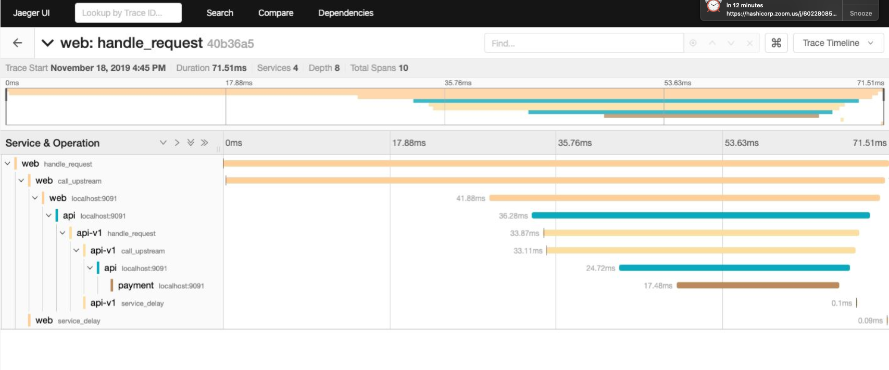
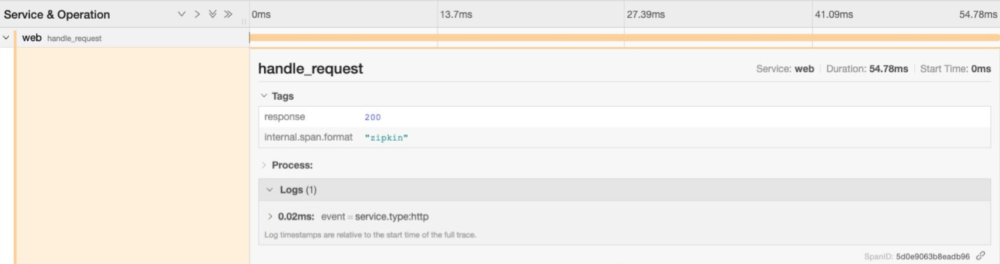

# Tracing

* Explain how tracing works with spans
* Show Jaeger and see proxy spans and application spans
* Add tracing for Payments
* Deploy Payments

The application you deployed in the previous step has been configured to use the [Zipkin](https://zipkin.io/) tracing protocol. Let's curl the Web endpoint to generate some traces.

```shell
➜ curl localhost:9090
{
  "name": "web",
  "uri": "/",
  "type": "HTTP",
  "start_time": "2019-11-18T15:01:32.655519",
  "end_time": "2019-11-18T15:01:32.710236",
  "duration": "54.7199ms",
  "body": "Hello World",
  "upstream_calls": [
    {
      "name": "api-v1",
      "uri": "http://localhost:9091",
      "type": "HTTP",
      "start_time": "2019-11-18T15:01:32.691269",
      "end_time": "2019-11-18T15:01:32.707108",
      "duration": "15.8386ms",
      "body": "Response from API v1",
      "upstream_calls": [
        {
          "uri": "http://localhost:9091",
          "code": 200
        }
      ],
      "code": 200
    }
  ],
  "code": 200
}
```

If you now look at the Jaeger which has been configured to collect and visualize the traces, and view a trace from the `web` service you will see the individual spans which make up a trace.

[localhost:16686/search?service=web](localhost:16686/search?service=web)



Traces are broken up into individual spans which relate to an action or function. The spans can have metadata in the form of Tags, and Logs attached to them. Click on one of the spans to see the metadata.



Spans are related by their ID, when a new span is created the ID of the parent is associated with it. The entire trace is not transmitted to the server in a single document as a trace can contain spans for multiple different services. Instead each span is transmitted to the server individually, it is the relation between parent and child which allows Jaeger to be able to reconstruct the individual spans into a trace.

When you are creating spans in code you can easily create child spans as the ID number can be passed in code. The problem is how do you pass the span id to an external service like when you call an upstream API? An example of this problem can be seen with the `Payment` and `Currency` service in the example app.

If you look at the trace, the last span in the chain is the `payments` span which has been created by the Envoy proxy in the service mesh. However; the full call chain should be Web -> API -> Payment -> Currency. The spans for `Payments` and `Currency` can be found in the Jaeger UI if you select them in the `Service` search box, but they are detached from the main trace.

The reason behind this is that the Payment service is not aware of any parent span id from the api service.

To rectify this situation we need to do two things: 
1. When making a call to an upstream service we pass the span id, trace id, and parent span id as HTTP headers. [https://github.com/openzipkin/b3-propagation](https://github.com/openzipkin/b3-propagation).
2. When handling requests we need to look for the presence of the zipkin headers, and use this information when creating a new span.
 
```
X-B3-TraceId: 80f198ee56343ba864fe8b2a57d3eff7
X-B3-ParentSpanId: 05e3ac9a4f6e3b90
X-B3-SpanId: e457b5a2e4d86bd1
X-B3-Sampled: 1
```

Thankfully the OpenTracing SDK makes this process nice and simple.

Open the `handler.go` file in the `payments-service` folder and add the following code to line 14. This code automatically extracts the headers from the request and creates a `wireContext`. You can then use this when creating the span.

```go
// attempt to create a span using a parent span defined in http headers
	wireContext, err := opentracing.GlobalTracer().Extract(
		opentracing.HTTPHeaders,
		opentracing.HTTPHeadersCarrier(r.Header),
	)

	if err != nil {
		// if there is no span in the headers an error will be raised, log
		// this error
		logger.Debug("Error obtaining context, creating new span", "error", err)
	}
```

Modify the `StartSpan` block to add the additional option `ext.RPCServerOption`, this will associate the new Span with the details from the inbound request.  

```go
	// Create the span referring to the RPC client if available.
	// If wireContext == nil, a root span will be created.
	serverSpan := opentracing.StartSpan(
		"handle_request",
		ext.RPCServerOption(wireContext))
	serverSpan.LogFields(log.String("service.type", "http"))

	defer serverSpan.Finish()
```

In the same way that the parent span is not automatically inferred from the headers the span id and other headers are not automatically added to the outbound request. We can add this information again using the OpenTracing API. First we are creating a new `clientSpan` using the context of the parent spans context.  We then 

```go
clientSpan := opentracing.StartSpan(
	"call_upstream",
	opentracing.ChildOf(serverSpan.Context()),
)

clientSpan.LogFields(log.String("upstream.type", "http"))

ext.SpanKindRPCClient.Set(clientSpan)
ext.HTTPUrl.Set(clientSpan, upstreamRequest.URL.String())
ext.HTTPMethod.Set(clientSpan, upstreamRequest.Method)

// Transmit the span's TraceContext as HTTP headers on our
// outbound request.
opentracing.GlobalTracer().Inject(
	clientSpan.Context(),
	opentracing.HTTPHeaders,
	opentracing.HTTPHeadersCarrier(upstreamRequest.Header))
```